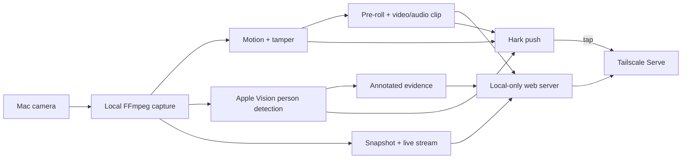

# Watchdog

A self-hosted macOS room monitor. Watchdog watches the camera locally, records movement with audio, distinguishes people from generic motion, warns if the camera is covered or moved, sends [Hark](https://hark.ryan.ceo/) notifications, and serves private snapshots, live video, and recordings through [Tailscale Serve](https://tailscale.com/docs/features/tailscale-serve).

Recordings stay on the Mac. Person detection uses Apple Vision on-device—camera frames are never sent to a vision API, and there is no face recognition.

> [!IMPORTANT]
> Use this only where you are legally allowed to record video and audio. Keep the camera inside your private room; do not capture shared hallways or spaces where others reasonably expect privacy without checking the applicable rules.

## Features

- Local motion detection with a configurable, memory-bounded video pre-roll.
- Automatic selection of the camera's highest supported landscape resolution.
- H.264 video and AAC audio with synchronized silence during the pre-trigger video.
- Optional on-device person detection using Apple Vision.
- Sustained camera-cover, darkness, or major-view-change detection and recovery alerts.
- An immediate trigger snapshot plus annotated person/tamper evidence images.
- Hark alerts for arming, motion, people, camera warnings, saved clips, disk warnings, and errors.
- Tailnet-only snapshot, MJPEG live view, and byte-range MP4 playback.
- Age, total-size, and minimum-free-space retention policies that never delete an active clip.
- A macOS LaunchAgent for automatic arming after login.
- Secure mode-`0600` local configuration with webhook redaction.



## Requirements

- macOS with a camera and microphone
- Python 3.10 or newer
- [FFmpeg](https://ffmpeg.org/) for AVFoundation capture and recording
- Apple Command Line Tools (`xcode-select --install`) for the automatic-login service launcher
- Optional: [Hark for iPhone](https://hark.ryan.ceo/docs) for notifications
- Optional: [Tailscale](https://tailscale.com/download/mac) on both Mac and phone for private remote viewing

The capture and person-detection paths are macOS-specific. Linux and Windows are not supported yet.

## Install

With Homebrew and `pipx`:

```bash
brew install ffmpeg pipx
git clone git@github.com:alecsiemerink/watchdog.git
cd watchdog
pipx install .
```

For development:

```bash
python3 -m venv .venv
.venv/bin/pip install -e '.[dev]'
.venv/bin/watchdog --version
```

## Configure

Create a service in the [Hark dashboard](https://hark.ryan.ceo/), copy its secret webhook URL, then run:

```bash
watchdog configure
```

The interactive prompt hides the webhook while it is pasted and asks whether to enable the Tailscale live view. Configuration is saved at:

```text
~/.config/watchdog/config.json
```

The file is mode `0600`. The webhook can instead be supplied through `WATCHDOG_HARK_URL`. Do not put the real URL in this repository or in shell history.

Before leaving the Mac, approve the macOS Camera and Microphone prompts and test the complete local capture path:

```bash
watchdog doctor
watchdog test-alert
```

If access was denied previously, open **System Settings → Privacy & Security → Camera** and **Microphone**, then allow the terminal or Python/FFmpeg process that launches Watchdog. The automatic-login service has its own stable “Watchdog” permission entry, described below.

## Use

```bash
# Arm in the background
watchdog start

# Confirm state and print the private live URL
watchdog status

# Capture a still and optionally send its private link through Hark
watchdog snapshot --notify

# Send the latest recording link through Hark
watchdog share --notify

# List recordings and preview the retention policy
watchdog recordings
watchdog retention --dry-run

# Disarm and safely finalize an active clip
watchdog stop
```

Recordings, evidence snapshots, and logs default to `~/Movies/Watchdog`.

### Start automatically after login

Run `doctor` from the installed executable first, then install the user LaunchAgent:

```bash
watchdog service install
watchdog service status
```

On first service launch, click **Allow** on the Camera and Microphone prompts for **Watchdog**. The installer builds a tiny ad-hoc-signed app wrapper at `~/.config/watchdog/Watchdog.app`; this gives macOS a stable graphical-app identity for privacy permissions while the LaunchAgent handles login startup. Its Dock icon disappears after permission onboarding, and it does not install a privileged helper.

To write the LaunchAgent without arming immediately, use `service install --no-start`; it will load after the next login. Remove it with:

```bash
watchdog service uninstall
```

This is a per-user LaunchAgent, not a privileged system daemon. It runs only in the logged-in graphical session.

LaunchAgent output is written to `~/.config/watchdog/launchagent.log` so launchd does not need to open a protected media folder for stdout/stderr. Recordings remain in the configured output directory.

### Tested release path

v0.1.0 was exercised end to end on a 2021 MacBook Pro (`MacBookPro18,3`, Apple M1 Pro) running macOS 15.7.4, Python 3.12.2, FFmpeg 8.1, and Tailscale 1.96.4. The real-hardware test covered automatic 1760×1328 selection, motion and person events, camera cover/recovery, H.264/AAC recording with pre-roll, Hark delivery, tailnet-only snapshots/live view/byte-range playback, clean `pipx` installation, and LaunchAgent startup. Unit tests also run in CI on Python 3.10, 3.12, and 3.14.

### Locking the Mac

Locking the screen is fine. Watchdog uses `caffeinate` to prevent idle system sleep while allowing the display to turn off. Keep the lid open. Closing the lid, logging out, restarting, or losing power stops the current session; the LaunchAgent re-arms after the next login. Use a charger for unattended monitoring.

## Notifications and private evidence

| Event | Evidence created | Hark tap destination |
| --- | --- | --- |
| Armed | Current live frame | Private Tailscale dashboard |
| Motion detected | Exact trigger snapshot | Private trigger image |
| Person detected | Snapshot with local Vision bounding box | Private person image |
| Camera obstructed/moved | Camera-warning snapshot | Private warning image |
| Camera recovered | None | Private live page |
| Recording saved | H.264/AAC MP4 | Exact private recording |
| Disk/fatal warning | Error details | Live page when available |

Hark's current `imageUrl` field requires an image that its public service can fetch; a tailnet-only URL cannot be rendered inline. Watchdog therefore makes the notification open the exact private evidence image. It never enables Tailscale Funnel or publishes a snapshot just to create a rich preview. This is the most private flow supported by the current [Hark webhook API](https://hark.ryan.ceo/docs).

## Tailscale live view

When enabled, Watchdog binds its HTTP server only to `127.0.0.1` and adds one path to the machine's existing Serve configuration:

```text
https://your-mac.your-tailnet.ts.net/watchdog/
```

The page has a live MJPEG view, a current JPEG snapshot, status badges for people/recording/camera warnings, and a link to the latest clip. Completed MP4s support HTTP byte ranges for mobile seeking.

Tailscale access rules still apply. Existing Serve paths are preserved. The project never enables [Tailscale Funnel](https://tailscale.com/docs/features/tailscale-funnel), so it does not make the feed public. Proxying the localhost server also works with the sandboxed macOS Tailscale app, which cannot directly serve files from protected user folders.

## Detection and recording defaults

- Capture: automatically selects the largest supported landscape mode at 30 fps; recording runs at 15 fps. The 640×480 values in config are safe fallbacks only.
- Motion: two consecutive checks with at least 2.5% changed sampled pixels.
- Pre-roll: three seconds of raw video in a bounded buffer. Memory use scales with the selected resolution; it is about 315 MB at 1760×1328.
- Audio: begins at the trigger and is timestamp-shifted to remain synchronized; pre-trigger video is silent.
- Clip duration: at least 15 seconds, stops after 30 quiet seconds, maximum 10 minutes.
- Person detection: one local Vision request per second, two positive hits to alert, five misses to clear, 50% minimum confidence.
- Camera warning: 10-frame baseline and eight seconds of sustained darkness, uniform cover, or major view shift; four seconds to declare recovery.
- Retention: 30 days, 10 GB total media, and a 2 GB free-disk floor.

Person detection is supported by the Apple Vision framework on both Apple Silicon and Intel Macs supported by the installed macOS/Python combination. It adds CPU and battery use, and alert latency includes the one-second sampling interval plus the configured persistence threshold. If Vision cannot load or fails, generic motion recording continues and the error is logged.

The obstruction detector compares against the view learned at startup. Start with an unobstructed camera; a camera that is already covered when the process launches may become its baseline.

Inspect every effective setting without exposing the webhook:

```bash
watchdog show-config
```

Common overrides:

```bash
watchdog configure \
  --max-resolution \
  --pre-roll-seconds 5 \
  --person-detection \
  --tamper-detection \
  --retention-days 14 \
  --retention-max-total-gb 5 \
  --minimum-free-disk-gb 3
```

At startup, Watchdog probes AVFoundation and chooses the compatible landscape mode with the most pixels. Use `watchdog configure --no-max-resolution` to keep the explicit `width` and `height` values instead. If probing is unavailable, those values are also the automatic fallback.

Set pre-roll to `0` to disable it; values above 10 seconds are rejected to bound memory use. Set a retention age or size to `0` to disable that individual limit. The free-disk floor is checked at startup and after completed clips.

## Security notes

- Treat the Hark webhook as a credential. Anyone holding it can notify your devices.
- Never commit config files, real tailnet hostnames, recordings, snapshots, or logs.
- Tailscale links work only for identities permitted by the tailnet policy.
- The green macOS camera indicator remains visible while monitoring.
- The live server has no directory listing and only serves recognized media names.
- Evidence images and recordings follow the same retention policy.
- Rotate a leaked Hark webhook in the Hark dashboard.

See [SECURITY.md](SECURITY.md) for vulnerability reporting.

## Development

```bash
ruff check .
ruff format --check .
python3 -m unittest discover -s tests -v
```

Pull requests are welcome. See [CONTRIBUTING.md](CONTRIBUTING.md), [CHANGELOG.md](CHANGELOG.md), and the [roadmap](ROADMAP.md).

## License

[MIT](LICENSE). Watchdog is independent and is not affiliated with Hark, Tailscale, Apple, or FFmpeg.
