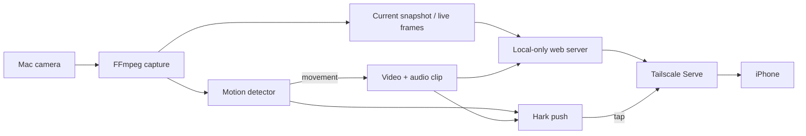

# Hotel Watchdog

A small, self-hosted macOS room monitor. It watches the built-in camera for movement, records video with audio, sends [Hark](https://hark.ryan.ceo/) notifications, and exposes snapshots, a live feed, and finished clips privately through [Tailscale Serve](https://tailscale.com/docs/features/tailscale-serve).

No account is required for Hotel Watchdog itself, and recordings stay on the Mac. Hark and Tailscale are optional integrations.

> [!IMPORTANT]
> Use this only where you are legally allowed to record. Do not point it into shared hallways or other spaces where people reasonably expect privacy without checking the applicable rules.

## What it does

- Detects motion without a cloud vision service.
- Starts an H.264/AAC recording when movement persists across two checks.
- Keeps recording until the room has been quiet for 30 seconds.
- Sends a Hark push when monitoring starts, when motion begins, and when a clip is ready.
- Opens a tailnet-only live page from the Hark notification.
- Shows a current snapshot first, followed by a low-frame-rate MJPEG live feed.
- Links finished recordings directly from Hark for mobile playback.
- Prevents idle system sleep while armed while still allowing the display to turn off.
- Stores the Hark webhook outside the repository in a mode-`0600` config file.



## Requirements

- macOS with a camera and microphone
- Python 3.10 or newer
- [FFmpeg](https://ffmpeg.org/) for camera capture and recording
- Optional: [Hark for iPhone](https://hark.ryan.ceo/docs) for notifications
- Optional: [Tailscale](https://tailscale.com/download/mac) on the Mac and phone for private remote viewing

The current capture path uses macOS AVFoundation. Linux and Windows are not supported yet.

## Install

With Homebrew and `pipx`:

```bash
brew install ffmpeg pipx
git clone git@github.com:alecsiemerink/hotel-watchdog.git
cd hotel-watchdog
pipx install .
```

For local development:

```bash
python3 -m venv .venv
.venv/bin/pip install -e .
.venv/bin/hotel-watchdog --version
```

## Configure

Create a service in the [Hark dashboard](https://hark.ryan.ceo/), copy its secret webhook URL, then run:

```bash
hotel-watchdog configure
```

The prompt hides the webhook while you type or paste it. It also asks whether to enable the Tailscale live view. Configuration lives at:

```text
~/.config/hotel-watchdog/config.json
```

The file is created with mode `0600`. You can alternatively provide the webhook at runtime through `HOTEL_WATCHDOG_HARK_URL`.

Before leaving the Mac unattended, verify the full capture path and approve the macOS Camera and Microphone prompts:

```bash
hotel-watchdog doctor
```

If macOS denied access previously, open **System Settings → Privacy & Security → Camera** and **Microphone**, then allow the terminal or Python/FFmpeg process that launches Hotel Watchdog.

## Use

```bash
# Arm in the background
hotel-watchdog start

# Confirm monitoring and print the private live URL
hotel-watchdog status

# Capture a still and optionally send its private URL through Hark
hotel-watchdog snapshot --notify

# Send the latest recording through Hark over Tailscale
hotel-watchdog share --notify

# List local recordings
hotel-watchdog recordings

# Disarm and safely finalize any active clip
hotel-watchdog stop
```

Recordings and logs default to `~/Movies/HotelWatchdog`.

### Locking the Mac

Locking the screen is fine: Hotel Watchdog runs in the logged-in session and uses `caffeinate` to prevent idle system sleep. Keep the lid open. Closing the lid, logging out, restarting, or losing power stops monitoring. A charger is strongly recommended.

## Hark notification flow

Hotel Watchdog uses the [Hark Notification API](https://hark.ryan.ceo/docs):

| Event | Notification | Tap destination |
| --- | --- | --- |
| Armed | Includes the private snapshot URL | Tailscale live page |
| Motion detected | Confirms video + audio recording started | Tailscale live page |
| Recording saved | Includes duration and size | Exact Tailscale recording URL |
| Fatal error | Includes the failure reason | Live page when available |

Hark requires `imageUrl` assets to be publicly reachable. A private Tailscale snapshot therefore cannot be embedded as a rich push image. Hotel Watchdog keeps the image private and makes the push open a live page whose first frame is the current snapshot.

## Tailscale live view

When enabled, Hotel Watchdog starts a localhost-only HTTP server and adds one path to the machine's existing Tailscale Serve configuration:

```text
https://your-mac.your-tailnet.ts.net/hotel-watchdog/
```

The page provides:

- a low-frame-rate live camera view;
- `snapshot.jpg` for the latest still;
- byte-range-enabled MP4 playback for completed recordings.

The server binds only to `127.0.0.1`; Tailscale Serve provides tailnet-only HTTPS access. Existing Serve paths are preserved. Tailnet access rules still apply. Hotel Watchdog never enables [Tailscale Funnel](https://tailscale.com/docs/features/tailscale-funnel), so it does not make the feed public.

On sandboxed macOS Tailscale builds, direct file serving from protected folders is unavailable. Proxying the local Hotel Watchdog server is the supported path and is why the app includes its small HTTP server. See the official [Tailscale Serve examples](https://tailscale.com/docs/reference/examples/serve).

## Motion and recording defaults

- Camera input: 640×480 at 30 fps
- Recording: 640×480 at 15 fps, H.264 video + AAC audio
- Motion checks: roughly twice per second
- Trigger: at least 2.5% of sampled pixels change by 22 luma levels, twice consecutively
- Quiet cutoff: 30 seconds
- Minimum clip: 15 seconds
- Maximum clip: 10 minutes; continued motion starts another clip

Advanced values can be changed in the local JSON config. Run `hotel-watchdog show-config` to inspect the effective values without exposing the webhook.

## Security notes

- Treat the Hark webhook as a credential. Anyone holding it can notify your devices.
- Never commit `config.json`, recordings, snapshots, or logs.
- Tailscale links work only for identities allowed by your tailnet policy.
- The green macOS camera indicator remains visible while monitoring.
- The local live server has no directory listing and only serves recognized recording filenames.
- Rotate a leaked Hark webhook in the Hark dashboard.

See [SECURITY.md](SECURITY.md) for reporting guidance.

## Development

```bash
python3 -m unittest discover -s tests -v
```

Pull requests are welcome. See [CONTRIBUTING.md](CONTRIBUTING.md) and the current [roadmap](ROADMAP.md).

## License

[MIT](LICENSE). Hotel Watchdog is an independent project and is not affiliated with Hark, Tailscale, Apple, or FFmpeg.
